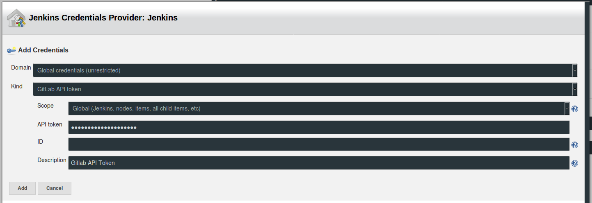
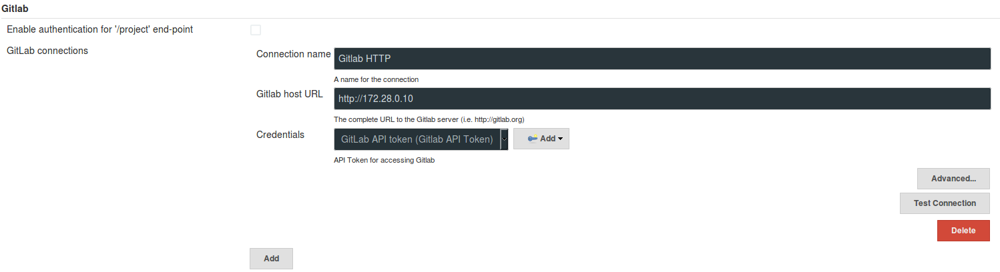
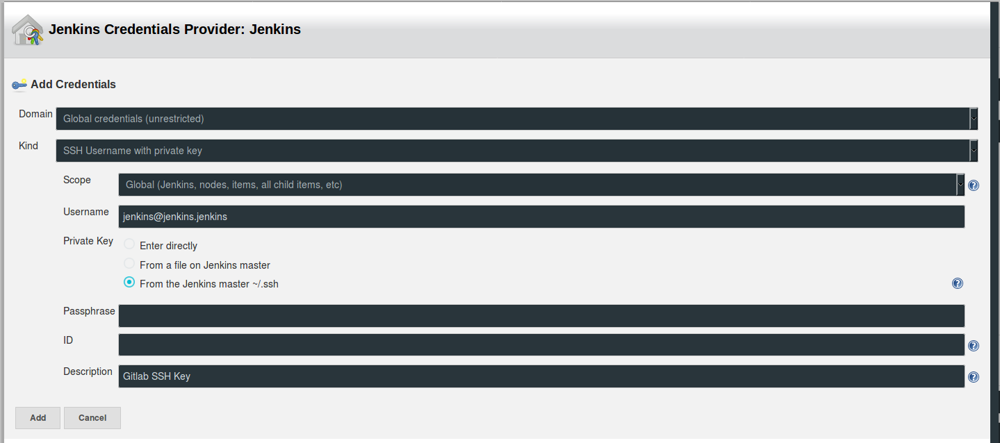

## Pipeline Gitlab / Jenkins / Docker

*JDEV2017 - Frédéric Woelffel*


---

## Moi ?

- Frédéric Woelffel
- Ingénieur R&D à l'IHU de Strasbourg
- Développeur Node.js

 <!-- .element: class="fragment" -->

---

https://goo.gl/AoEhcG

(http://static.fwoelffel.me/JDEV2017/ap02)

---

## Pré-requis

----

Binaires :
- docker 17.03
- git

----

Images Docker :

```
docker pull gitlab/gitlab-ce:9.3.0-ce.0
docker pull parabuzzle/craneoperator:2.1.3
docker pull registry:2
docker pull rancher/server:v1.6.2
docker pull rancher/agent:v1.2.2
docker pull jenkins:2.60.1-alpine
docker pull fwoelffel/jenkins-slave-dind:latest
```

----

Créons un réseau Docker pour cet atelier

```
docker network create --subnet=172.28.0.0/16 jdev
```

----

Mettons à jour la configuration du daemon Docker

```
sudo nano /etc/docker/daemon.json
```

```json
{
  ...
  "insecure-registries" : [ "172.28.0.0/16" ]
  ...
}
```

----

Redémarrons le daemon Docker

```
sudo service docker restart
```

---

## Installons Jenkins

----

Démarrons une instance de Jenkins

```
docker run \
  --detach \
  --publish 8080:8080 \
  --publish 50000:50000 \
  --link gitlab \
  --net jdev \
  --ip 172.28.0.13 \
  --name jenkins \
  jenkins:2.60.1-alpine
```

----

Débloquons l'instance en récupérant le mot de passe administrateur

```
docker exec jenkins cat /var/jenkins_home/secrets/initialAdminPassword
```

http://127.0.0.1:8080/login

----

Choisissons de n'installer que les plugins suivants
- Gitlab Plugin
- Pipeline

----

Continuons en tant qu'administrateur et installons un plugin supplémentaire (choisissez l'installation après **redémarrage**)

http://127.0.0.1:8080/pluginManager/available

Self-Organizing Swarm Plug-in Modules

---

## Hello world!

----

Commençons par créer un nouveau projet Jenkins de type *Freestyle project* nommé *echo*

http://127.0.0.1:8080/newJob

----

Rendons-nous directement dans la section *Build*

----

Ajoutons une étape de build de type *Execute shell* et copions-y la ligne suivante

```sh
echo 'Hello world!'
```

----

Après avoir sauvegardé nous sommes redirigés vers la page du projet.
Déclenchons l'exécution du projet en cliquant sur le bouton *Build now*

(http://127.0.0.1:8080/job/echo/build?delay=0sec)

----

Nous venons d'exécuter notre premier projet Jenkins !

http://127.0.0.1:8080/job/echo/1/console

---

## Installons Gitlab CE

----

Démarrons une instance de Gitlab CE

```
docker run \
  --detach \
  --publish 80:80 \
  --publish 22:22 \
  --net jdev \
  --ip 172.28.0.10 \
  --name gitlab \
  --env GITLAB_OMNIBUS_CONFIG="external_url 'http://172.28.0.1/'" \
  gitlab/gitlab-ce:9.3.0-ce.0
```

----

- Rendons nous sur la page d'accueil de cette instance Gitlab http://127.0.0.1
- Définissons un mot de passe administrateur (password, c'est facile à retenir)
- Connectons nous
- Créons le groupe *jdev*

---

## Préparons un registre Docker privé

----

Démarrons une instance de registre

```
docker run \
  --detach \
  --publish 5000:5000 \
  --net jdev \
  --ip 172.28.0.11 \
  --name registry \
  registry:2
```

----

Vérifions qu'il est correctement exécuté

http://127.0.0.1:5000/v2/_catalog

La réponse attendue est la suivante

```json
{
  "repositories": []
}
```

---

## Rajoutons une interface graphique

----

Démarrons une instance d'interface graphique pour le registre Docker

```
docker run \
  --detach \
  --publish 5001:80 \
  --net jdev \
  --ip 172.28.0.12 \
  --env REGISTRY_HOST=172.28.0.11 \
  --env REGISTRY_PORT=5000 \
  --env REGISTRY_PROTO=http \
  --env REGISTRY_PUBLIC_URL=http://127.0.0.1:5000 \
  --name registry-ui \
  parabuzzle/craneoperator:2.1.3
```

----

Admirons

http://127.0.0.1:5001

---

## Ajoutons un slave Jenkins

----

Démarrons simplement ce slave Docker

```
docker run \
  --detach \
  --name jenkins-slave \
  --privileged \
  --net jdev \
  --ip 172.28.0.14 \
  --env DOCKER_DAEMON_ARGS="--insecure-registry 172.28.0.0/16" \
  --env COMMAND_OPTIONS="-master http://172.28.0.13:8080 -username admin -password < votre password > -labels docker" \
  fwoelffel/jenkins-slave-dind
```

---

## Initialisons un projet

----

Commençons par instancier le projet *hello-world* sur Gitlab

----

Récupérons les sources d'une application sur Github

```
git clone https://github.com/FWoelffel/express-hello-world.git
```

----

Publions cette application sur notre instance de Gitlab

```
cd express-hello-world
git remote add jdev http://127.0.0.1/jdev/hello-world
git push --set-upstream jdev master
```

---

## Configurons les accès Gitlab-Jenkins

----

Créons un utilisateur Gitlab pour Jenkins

http://127.0.0.1/admin/users/new

| Champ | Valeur |
| --- | --- |
| Name | jenkins |
| Username | jenkins |
| Email | jenkins@jenkins.jenkins |

----

Ajoutons lui un accès *Developper* au projet

http://127.0.0.1/jdev/hello-world/settings/members

----

Incarnons ensuite cet utilisateur...

http://127.0.0.1/admin/users/jenkins

----

...et récupérons un token d'accès à l'API de Gitlab

http://127.0.0.1/profile/personal_access_tokens

----

Dans la configuration globale de Jenkins, renseignons les champs requis pour Gitlab

http://127.0.0.1:8080/configure

----



----




----

Testons ensuite la connexion.

 <!-- .element: class="fragment" -->

----

Créons également une clef SSH pour l'accès à Gitlab via SSH.

```
docker exec -it jenkins ssh-keygen -t rsa -C "jenkins@jenkins.jenkins" -b 1024
docker exec -it jenkins cat /var/jenkins_home/.ssh/id_rsa.pub
```

----

Ajoutons cette clef au profil de l'utilisateur Jenkins sur Gitlab

http://127.0.0.1/profile/keys

----

Créons également un nouvel identifiant SSH sur Jenkins

----



---

<!-- .slide: data-background="./img/excited_jhill.gif" -->

## Définissons nos premiers jobs

----

Ca se passe ici

http://127.0.0.1:8080/newJob

Créons un projet Freestyle *hello-world-freestyle*

----

Configurons une restriction d'exécution sur les noeuds possédant le label *docker*

----

Dans la section  *Source Code Management* cochons *git*

----

Saisissons les valeurs suivantes

| Champ | Valeur |
| --- | --- |
| Repository URL | git@172.28.0.10:jdev/hello-world.git |
| Credentials | Gitlab SSH Key |
| Name | origin |

...

----

...

| Champ | Valeur |
| --- | --- |
| Refspec | +refs/heads/\*:refs/remotes/origin/\* +refs/merge-requests/\*/head:refs/remotes/origin/merge-requests/\* |
| Branch Specifier | origin/${gitlabSourceBranch} |
<!-- +refs/heads/*:refs/remotes/origin/* +refs/merge-requests/*/head:refs/remotes/origin/merge-requests/* -->


----

Configurons ensuite les *Build Triggers*

Nous allons configurer un déclenchement de build par webhook, cochons donc la case correspondante

----

Saisissons les valeurs suivantes

| Champ | Valeur |
| --- | --- |
| Push events | Ok |
| MR events | Ok |
| Rebuild MR | On push to source branch |
| Comments | NOk |
| Enable CI Skip | Ok |
| Ignore WIP | Ok |
| Allowed branches | Toutes |

----

Générons le token et prenons en note.

----

Configurons ensuite Gitlab pour appeler ce webhook

http://127.0.0.1/jdev/hello-world/settings/integrations

----

| Champ | Valeur |
| --- | --- |
| URL | http://172.28.0.13:8080/project/build |
| Token | ... |
| Push events | Ok |
| Tag push events | Ok |
| MR events | Ok |
| Le reste | NOk |

----

Maintenant, les scripts !


----

### Builder une image

*Execute shell*

```
COMMMIT_SHORT_SHA=$(git rev-parse --short HEAD)
docker build -t 172.28.0.11:5000/hello-world:ci_$COMMMIT_SHORT_SHA .
```

----

### Publier une image

*Execute shell*

```
COMMMIT_SHORT_SHA=$(git rev-parse --short HEAD)
docker push 172.28.0.11:5000/hello-world:ci_$COMMMIT_SHORT_SHA
```

----

Enfin, ajoutons un feedback vers Gitlab en ajoutant une étape *Post-build* de type *Publish build status to Gitlab commit*

N'oublions pas de nommer ce build *hello-world-freestyle*

----

Testons ce projet en déclenchant un appel du webhook via Gitlab

http://127.0.0.1/jdev/hello-world/settings/integrations

----

Okay... Mais avec un Pipeline ce serait plus sympa

---

## Le Pipeline c'est maintenant

----

Créons un nouveau job de type *Pipeline* nommé *hello-world*

http://127.0.0.1:8080/newJob

----

Reprenons la même configuration pour les *Build triggers*

N'oublions pas de rajouter l'intégration sur Gitlab

http://127.0.0.1/jdev/hello-world/settings/integrations

----

Nous allons définir notre pipeline directement dans l'interface Jenkins

(Il est possible de le stocker dans un dépôt git)

----

### Récupérer les sources

```groovy
pipeline {
  agent {
    label 'docker'
  }
  stages {
    stage('Checkout') {
      steps {
        checkout(
           scm: [
               $class: "GitSCM",
               userRemoteConfigs: [
                   [url: "git@172.28.0.10:jdev/hello-world.git", credentialsId: "< id de votre credential ssh >"]
               ],
               branches: [
                   [name: env.gitlabSourceBranch]
               ]
           ]
         )
      }
    }
  }
}
```

Récupérez la bonne valeur de *credentialsId* pour l'identifiant "Gitlab SSH Key"

http://127.0.0.1:8080/credentials/

----

Validons ce premier *stage* en testant le webhook

http://127.0.0.1/jdev/hello-world/settings/integrations

----

### Builder une image

```groovy
pipeline {
  agent {
    label 'docker'
  }
  stages {
    stage('Checkout') {
      steps {
        checkout(
          scm: [
             $class: "GitSCM",
             userRemoteConfigs: [
                 [url: "git@172.28.0.10:jdev/hello-world.git", credentialsId: "< id de votre credential ssh >"]
             ],
             branches: [
                 [name: env.gitlabSourceBranch]
             ]
          ]
        )
      }
    }
    stage('Build') {
      steps {
        sh '''
        COMMMIT_SHORT_SHA=$(git rev-parse --short HEAD)
        docker build -t 172.28.0.11:5000/hello-world:ci_$COMMMIT_SHORT_SHA .
        docker push 172.28.0.11:5000/hello-world:ci_$COMMMIT_SHORT_SHA
        '''
      }
    }
  }
}
```

----

### Tester une image

```groovy
pipeline {
  agent {
    label 'docker'
  }
  stages {
    stage('Checkout') {
      steps {
        checkout(
          scm: [
             $class: "GitSCM",
             userRemoteConfigs: [
                 [url: "git@172.28.0.10:jdev/hello-world.git", credentialsId: "< id de votre credential ssh >"]
             ],
             branches: [
                 [name: env.gitlabSourceBranch]
             ]
          ]
        )
      }
    }
    stage('Build') {
      steps {
        sh '''
        COMMMIT_SHORT_SHA=$(git rev-parse --short HEAD)
        docker build -t 172.28.0.11:5000/hello-world:ci_$COMMMIT_SHORT_SHA .
        docker push 172.28.0.11:5000/hello-world:ci_$COMMMIT_SHORT_SHA
        '''
      }
    }
    stage('Tests') {
      steps {
        sh '''
        COMMMIT_SHORT_SHA=$(git rev-parse --short HEAD)
        docker run 172.28.0.11:5000/hello-world:ci_$COMMMIT_SHORT_SHA test
        '''
      }
    }
  }
}
```

----

### Releaser une image

```groovy
pipeline {
  agent {
    label 'docker'
  }
  stages {
    stage('Checkout') {
      steps {
        checkout(
          scm: [
             $class: "GitSCM",
             userRemoteConfigs: [
                 [url: "git@172.28.0.10:jdev/hello-world.git", credentialsId: "< id de votre credential ssh >"]
             ],
             branches: [
                 [name: env.gitlabSourceBranch]
             ]
          ]
        )
      }
    }
    stage('Build') {
      steps {
        sh '''
        COMMMIT_SHORT_SHA=$(git rev-parse --short HEAD)
        docker build -t 172.28.0.11:5000/hello-world:ci_$COMMMIT_SHORT_SHA .
        docker push 172.28.0.11:5000/hello-world:ci_$COMMMIT_SHORT_SHA
        '''
      }
    }
    stage('Tests') {
      steps {
        sh '''
        COMMMIT_SHORT_SHA=$(git rev-parse --short HEAD)
        docker run 172.28.0.11:5000/hello-world:ci_$COMMMIT_SHORT_SHA test
        '''
      }
    }
    stage('Release:Latest') {
      when {
        expression {
          return env.gitlabSourceBranch == 'master'
        }
      }
      steps {
        sh '''
        COMMMIT_SHORT_SHA=$(git rev-parse --short HEAD)
        docker tag 172.28.0.11:5000/hello-world:ci_$COMMMIT_SHORT_SHA 172.28.0.11:5000/hello-world:latest
        docker push 172.28.0.11:5000/hello-world:latest
        '''
      }
    }
    stage('Release:Tagged') {
      when {
        expression {
          TAGGED = sh (
            script: "git describe --exact-match --tags",
            returnStatus: true
          ) == 0
          return TAGGED
        }
      }
      steps {
        sh '''
        COMMMIT_SHORT_SHA=$(git rev-parse --short HEAD)
        COMMIT_TAG=$(git describe --exact-match --tags)
        docker tag 172.28.0.11:5000/hello-world:ci_$COMMMIT_SHORT_SHA 172.28.0.11:5000/hello-world:$COMMIT_TAG
        docker push 172.28.0.11:5000/hello-world:$COMMIT_TAG
        '''
      }
    }
  }
}
```

----

Et avec un peu de feedback...

```
pipeline {
  agent {
    label 'docker'
  }
  stages {
    stage('Checkout') {
      steps {
        updateGitlabCommitStatus name: 'hello-world', state: 'running'
        checkout(
          scm: [
             $class: "GitSCM",
             userRemoteConfigs: [
                 [url: "git@172.28.0.10:jdev/hello-world.git", credentialsId: "< id de votre credential ssh >"]
             ],
             branches: [
                 [name: env.gitlabSourceBranch]
             ]
          ]
        )
      }
    }
    stage('Build') {
      steps {
        sh '''
        COMMMIT_SHORT_SHA=$(git rev-parse --short HEAD)
        docker build -t 172.28.0.11:5000/hello-world:ci_$COMMMIT_SHORT_SHA .
        docker push 172.28.0.11:5000/hello-world:ci_$COMMMIT_SHORT_SHA
        '''
      }
    }
    stage('Tests') {
      steps {
        sh '''
        COMMMIT_SHORT_SHA=$(git rev-parse --short HEAD)
        docker run 172.28.0.11:5000/hello-world:ci_$COMMMIT_SHORT_SHA test
        '''
      }
    }
    stage('Release:Latest') {
      when {
        expression {
          return env.gitlabSourceBranch == 'master'
        }
      }
      steps {
        sh '''
        COMMMIT_SHORT_SHA=$(git rev-parse --short HEAD)
        docker tag 172.28.0.11:5000/hello-world:ci_$COMMMIT_SHORT_SHA 172.28.0.11:5000/hello-world:latest
        docker push 172.28.0.11:5000/hello-world:latest
        '''
      }
    }
    stage('Release:Tagged') {
      when {
        expression {
          TAGGED = sh (
            script: "git describe --exact-match --tags",
            returnStatus: true
          ) == 0
          return TAGGED
        }
      }
      steps {
        sh '''
        COMMMIT_SHORT_SHA=$(git rev-parse --short HEAD)
        COMMIT_TAG=$(git describe --exact-match --tags)
        docker tag 172.28.0.11:5000/hello-world:ci_$COMMMIT_SHORT_SHA 172.28.0.11:5000/hello-world:$COMMIT_TAG
        docker push 172.28.0.11:5000/hello-world:$COMMIT_TAG
        '''
      }
    }
  }
  post {
    success {
      updateGitlabCommitStatus name: 'hello-world', state: 'success'
    }
    failure {
      updateGitlabCommitStatus name: 'hello-world', state: 'failed'
    }
  }
}
```

----

Et si je souhaite conserver une trace de mon build ?

----

### Générons un artefact

```
stage('Documentation') {
  steps {
    sh '''
      echo "On s'eclate !" >> ma_documentation.txt
    '''
    archiveArtifacts artifacts: "ma_documentation.txt", fingerprint: true
  }
}
```

----

Pratique !

http://127.0.0.1:8080/job/hello-world/lastSuccessfulBuild/artifact/ma_documentation.txt

 <!-- .element: class="fragment" -->

---

## Encore un peu de temps ?

----

<!-- .slide: data-background="./img/rock_cool.gif" -->

----

## Et si j'ai envie de déployer mon application ?

----

Ajoutons un fichier *docker-compose.yml* à notre projet

```yaml
version: '2'
services:
  hello-world:
    image: 172.28.0.1:5000/hello-world:latest
    ports:
      - 3000:3000
```

----

```
git add docker-compose.yml
git commit -m "chore(docker): Add a Docker orchestration file [skip ci]"
git push
```

----

## Installons un outil d'orchestration de conteneurs

----

Démarrons une instance de Rancher Server

```
docker run \
  --detach \
  --net jdev \
  --ip 172.28.0.15 \
  --publish 8081:8080 \
  --name rancher-server \
  rancher/server:v1.6.2
```

----

Vérifions que ce conteneur est bien démarré

http://127.0.0.1:8081

----

## Mettons en place une instance de Rancher Agent

----

Commençons par mettre à jour l'URL d'inscription des agents avec la valeur http://172.28.0.1:8081

----

Démarrons une instance de Rancher Agent sur le réseau par défaut de Docker

```
docker run \
  --detach\
  --rm \
  --env CATTLE_AGENT_IP="172.17.0.1"
  --volume /var/run/docker.sock:/var/run/docker.sock \
  --volume /var/lib/rancher:/var/lib/rancher \
  rancher/agent:v1.2.2 http://172.28.0.1:8080/v1/scripts/FEADA433891177754729:1483142400000:F3TVBX3X1LGIL9wHVoUnMMiQkYk
```

----

Nous disposons maintenant d'un esclave Rancher.

----

## Initialisons notre orchestration

----

Rendons-nous à l'adresse suivante et ajoutons une nouvelle stack.

http://127.0.0.1:8081/env/1a7/apps/stacks?which=all

----

Appelons cette stack *staging* et collons le contenu de notre fichier *docker-compose.yml* dans le bloc approprié.

----

## Et si j'ai envie que mon application se déploie automatiquement ?

----

Commençons par récupérer un accès à l'API de Rancher

http://127.0.0.1:8081/env/1a5/api/keys

----

Mettons notre pipeline à jour

```
pipeline {
  agent {
    label 'docker'
  }
  stages {
    stage('Checkout') {
      steps {
        updateGitlabCommitStatus name: 'hello-world', state: 'running'
        checkout(
          scm: [
             $class: "GitSCM",
             userRemoteConfigs: [
                 [url: "git@172.28.0.10:jdev/hello-world.git", credentialsId: "< id de votre credential ssh >"]
             ],
             branches: [
                 [name: env.gitlabSourceBranch]
             ]
          ]
        )
      }
    }
    stage('Build') {
      steps {
        sh '''
        COMMMIT_SHORT_SHA=$(git rev-parse --short HEAD)
        docker build -t 172.28.0.11:5000/hello-world:ci_$COMMMIT_SHORT_SHA .
        docker push 172.28.0.11:5000/hello-world:ci_$COMMMIT_SHORT_SHA
        '''
      }
    }
    stage('Tests') {
      steps {
        sh '''
        COMMMIT_SHORT_SHA=$(git rev-parse --short HEAD)
        docker run 172.28.0.11:5000/hello-world:ci_$COMMMIT_SHORT_SHA test
        '''
      }
    }
    stage('Release:Latest') {
      when {
        expression {
          return env.gitlabSourceBranch == 'master'
        }
      }
      steps {
        sh '''
        COMMMIT_SHORT_SHA=$(git rev-parse --short HEAD)
        docker tag 172.28.0.11:5000/hello-world:ci_$COMMMIT_SHORT_SHA 172.28.0.11:5000/hello-world:latest
        docker push 172.28.0.11:5000/hello-world:latest
        '''
      }
    }
    stage('Release:Tagged') {
      when {
        expression {
          TAGGED = sh (
            script: "git describe --exact-match --tags",
            returnStatus: true
          ) == 0
          return TAGGED
        }
      }
      steps {
        sh '''
        COMMMIT_SHORT_SHA=$(git rev-parse --short HEAD)
        COMMIT_TAG=$(git describe --exact-match --tags)
        docker tag 172.28.0.11:5000/hello-world:ci_$COMMMIT_SHORT_SHA 172.28.0.11:5000/hello-world:$COMMIT_TAG
        docker push 172.28.0.11:5000/hello-world:$COMMIT_TAG
        '''
      }
    }
    stage('Deploy:Staging') {
      when {
        expression {
          return env.gitlabSourceBranch == 'master'
        }
      }
      steps {
        sh '''
        docker run --rm --volume $(pwd):/mnt rancher/cli --env Default --url http://172.28.0.1:8081/v1 --access-key <RANCHER_ACCESS_KEY> --secret-key <RANCHER_SECRET_KEY> up -d --upgrade --force-upgrade --stack staging --pull hello-world
        docker run --rm --volume $(pwd):/mnt rancher/cli --env Default --url http://172.28.0.1:8081/v1 --access-key <RANCHER_ACCESS_KEY> --secret-key <RANCHER_SECRET_KEY> up -d --confirm-upgrade --stack staging
        '''
      }
    }
  }
  post {
    success {
      updateGitlabCommitStatus name: 'hello-world', state: 'success'
    }
    failure {
      updateGitlabCommitStatus name: 'hello-world', state: 'failed'
    }
  }
}
```

----

Il ne nous reste qu'à l'essayer

http://127.0.0.1/jdev/hello-world/settings/integrations

----

Des sceptiques ?


Modifions notre *Hello world!* (api.js)

http://127.0.0.1/jdev/hello-world/edit/master/api.js

----

http://127.0.0.1:3000

---

<!-- .slide: data-background="./img/standing_ovation.gif" -->

---

## En résumé

----

- Installation de Gitlab CE
- Installation d'un registre Docker et de son interface graphique
- Installation de Jenkins
- Installation d'un slave Docker-in-Docker pour Jenkins
- Configuration d'un pipeline de CI
- Mise en place d'un environnement d'intégration
- Configuration du déploiement automatique des services

---

### Pipeline Gitlab / Jenkins / Docker

*JDEV2017 - Frédéric Woelffel*


-----

frederic.woelffel@ihu-strasbourg.eu
